# Medical Device Failure & Healthcare Financial Risk BI Project

## Project Overview

This project is an end-to-end business intelligence analysis focused on medical device failure, maintenance cost, downtime, replacement review, and healthcare financial impact.

Hospitals and healthcare organizations rely on medical devices, equipment availability, maintenance schedules, staffing, and supplies to support safe and efficient operations. Device failures, high downtime, and costly maintenance can create operational disruption and financial risk.

The goal of this project is to analyze medical device failure patterns and financial expense trends using Python, SQL, Excel, Power BI, and PowerPoint.

## Business Problem

Healthcare organizations need better visibility into which medical devices create the greatest operational and financial burden. Medical device failures can increase downtime, raise maintenance costs, and create replacement planning concerns.

This project helps identify:

* Device types with the highest failure burden
* Manufacturers associated with higher maintenance cost
* Devices with higher downtime and risk scores
* Devices flagged for replacement review
* Financial expense categories driving healthcare costs
* Data quality issues corrected before dashboard development

## Tools Used

* Python / Jupyter Notebook
* Pandas and NumPy
* SQL
* Microsoft Excel
* Power BI
* PowerPoint
* GitHub

## Datasets

The project uses two datasets:

1. **Medical Device Failure Dataset**

   * Device type
   * Purchase date
   * Device age
   * Manufacturer
   * Maintenance cost
   * Downtime
   * Maintenance frequency
   * Failure event count
   * Maintenance class
   * Maintenance report text

2. **Financial Data**

   * Expense date
   * Expense category
   * Amount
   * Description

## Data Cleaning Summary

Python was used to clean and prepare the datasets before analysis.

Key cleaning steps included:

* Standardized column names
* Converted date fields
* Cleaned text fields
* Corrected negative maintenance cost values
* Created maintenance severity labels
* Created device age bands
* Created failure type categories from maintenance report text
* Corrected financial expense categories based on description
* Created operational risk score and risk level
* Created replacement review flag

## Data Validation Summary

Validation checks were completed before analysis and dashboard development.

Key validation checks included:

* Row count validation
* Missing value checks
* Duplicate row checks
* Date validation
* Numeric range validation
* Negative maintenance cost correction validation
* Financial category correction validation
* Risk level logic validation
* Replacement review flag validation

All major validation checks passed.

## Key KPIs

| KPI                        |    Value |
| -------------------------- | -------: |
| Total Devices              |    4,149 |
| Total Failure Events       |    8,123 |
| Average Downtime Hours     |    10.62 |
| Total Maintenance Cost     |   $36.1M |
| High-Risk Devices          |      357 |
| Replacement Review Devices |    1,054 |
| Total Financial Expenses   |   $12.4M |
| Top Expense Category       | Staffing |

## Power BI Dashboard Pages

The Power BI dashboard includes four pages:

1. **Executive Overview**

   * High-level KPI summary
   * Maintenance cost by manufacturer
   * Failure events by device type
   * Operational risk distribution
   * Replacement review summary

2. **Device Risk Analysis**

   * Risk and replacement KPIs
   * Failure events by device type
   * Failure events by failure type
   * Downtime by risk level
   * Maintenance cost vs downtime scatter analysis
   * Replacement review device table

3. **Financial Impact Analysis**

   * Expense KPIs
   * Expense category analysis
   * Expense detail matrix
   * Monthly financial expense trend
   * Device maintenance cost context

4. **Data Quality & Validation**

   * Row count validation
   * Missing value checks
   * Negative maintenance cost correction tracking
   * Financial category correction tracking
   * Operational risk validation
   * Replacement review validation
   * Validation summary table

## Dashboard Screenshots

### Executive Overview
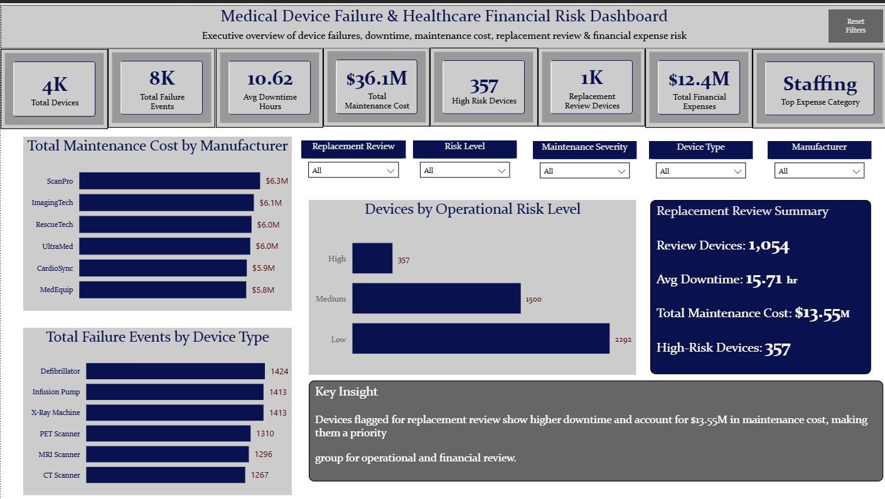

### Device Risk Analysis
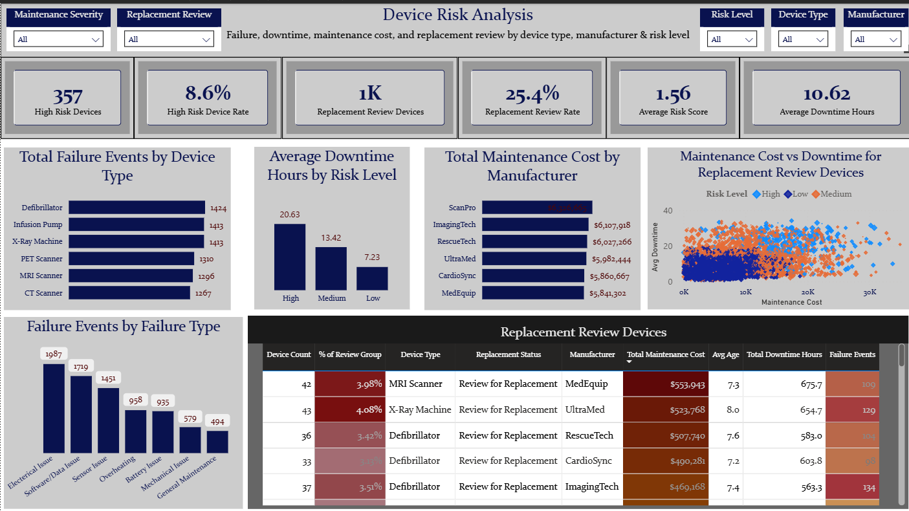

### Financial Impact Analysis
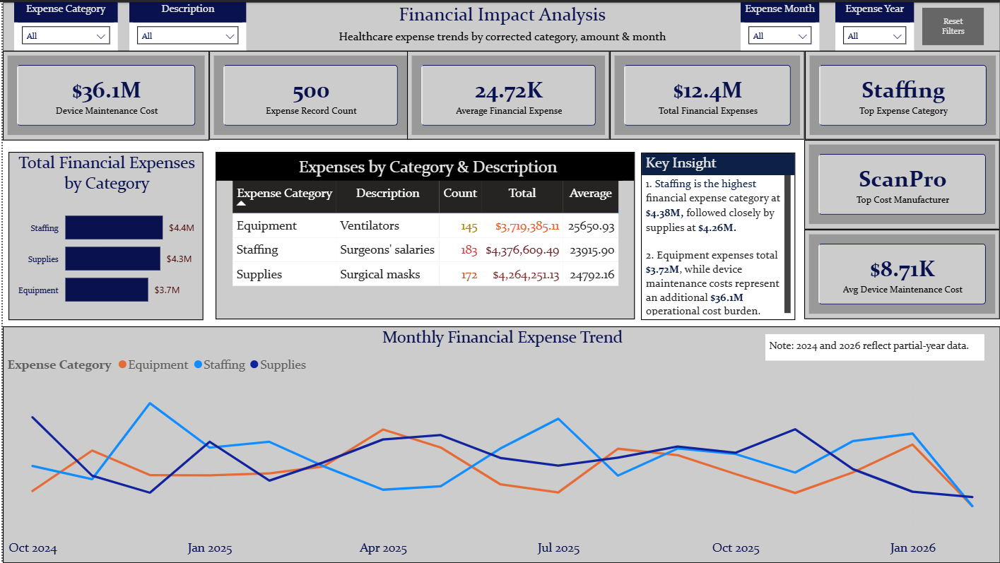

### Data Quality & Validation
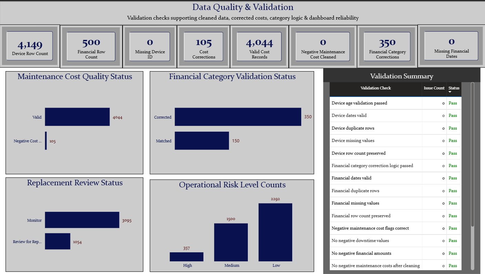

## Excel Workbook Screenshots

### Excel Executive Summary
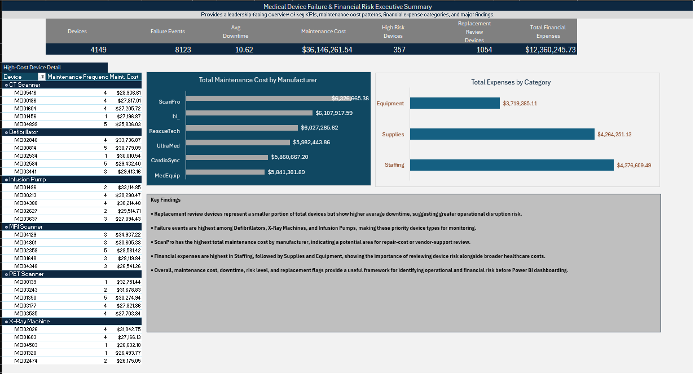

### Excel Device Risk Analysis
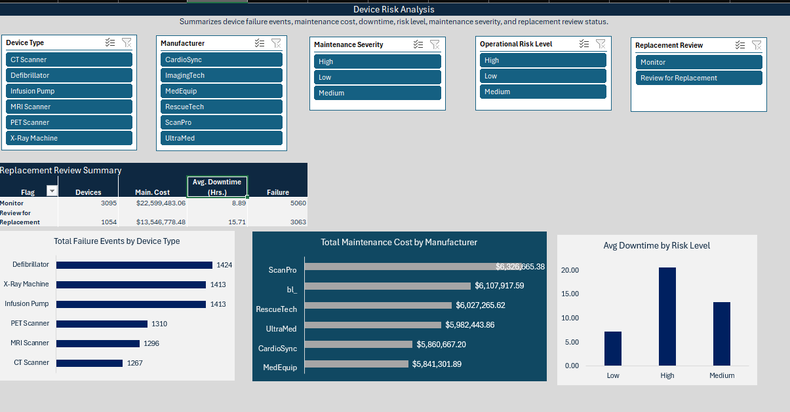

### Excel Financial Analysis
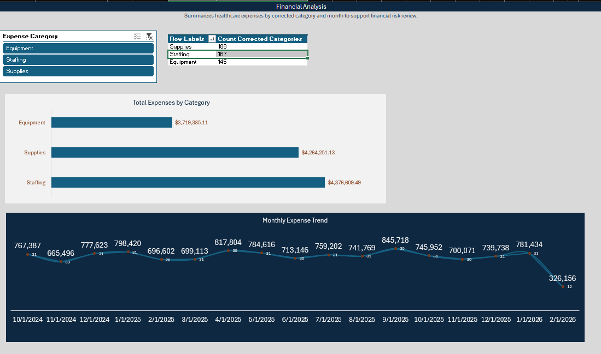

## Python EDA Screenshots

### KPI Definition
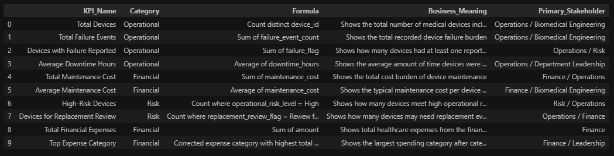

### EDA Summary
.png)

### Failure Type Summary
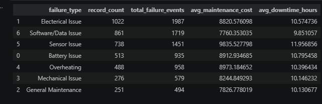

### Manufacturer Summary


### Risk Summary
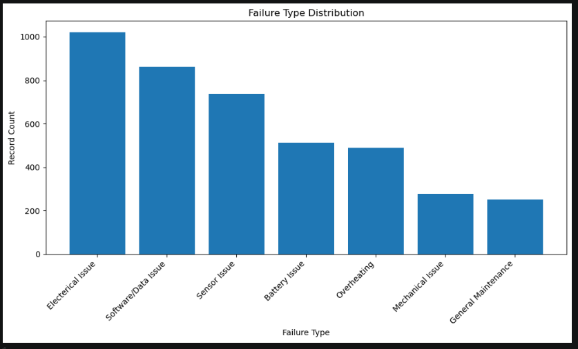

### Replacement Summary
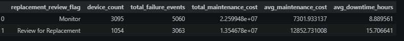

### Financial Category Summary


### Monthly Financial Expense Trend
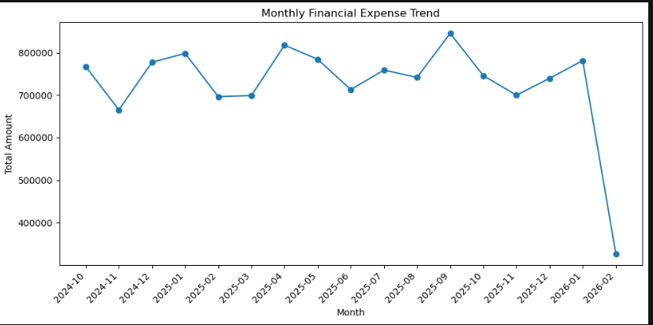

### Total Cost by Manufacturer
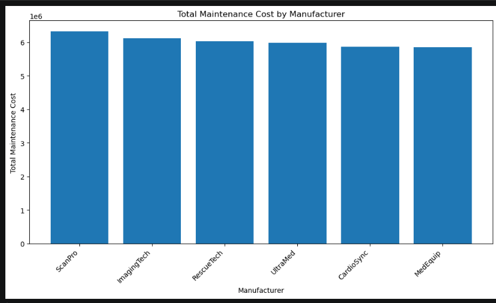

### Total Failure Events by Device Type
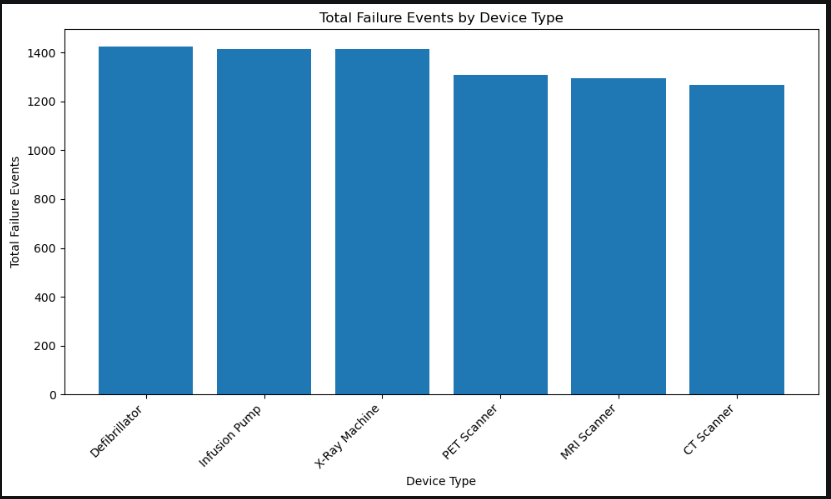
## Key Findings

* Defibrillators, Infusion Pumps, and X-Ray Machines showed the highest total failure events.
* Devices flagged for replacement review showed higher downtime and represented an important operational review group.
* High-risk devices accounted for 357 device records.
* A total of 1,054 devices were flagged for replacement review.
* Total maintenance cost reached approximately $36.1M.
* Staffing was the highest financial expense category, followed by supplies and equipment.
* Financial expenses totaled approximately $12.4M across 500 records.
* Negative maintenance cost values and mismatched financial categories were corrected and validated before reporting.

## Recommendations

1. Prioritize replacement review devices with high downtime and high maintenance cost.
2. Monitor high-failure device types such as Defibrillators, Infusion Pumps, and X-Ray Machines.
3. Review manufacturer-level maintenance cost trends, especially high-cost manufacturers.
4. Continue validating financial category labels before reporting expense trends.
5. Use the Power BI dashboard as an operational monitoring tool for device risk and financial impact.

## Project Workflow

1. **Python**

   * Imported raw datasets
   * Cleaned and transformed data
   * Created validation checks
   * Exported cleaned datasets and summaries

2. **SQL**

   * Validated imported cleaned tables
   * Created KPI queries
   * Queried device failure, manufacturer cost, risk, and financial expense patterns

3. **Excel**

   * Built KPI validation workbook
   * Created data quality checks
   * Built PivotTable analysis pages
   * Created executive summary page

4. **Power BI**

   * Built interactive dashboard
   * Created KPI cards, slicers, charts, tables, and validation views

5. **PowerPoint**

   * Created executive summary presentation

## Repository Structure

```text
data/
docs/
notebooks/
sql/
excel/
powerbi/
powerpoint/
images/
README.md
```

## Portfolio Purpose

This project demonstrates business intelligence and data analyst skills including data cleaning, validation, exploratory analysis, SQL querying, Excel validation, Power BI dashboard design, executive reporting, and GitHub documentation.

